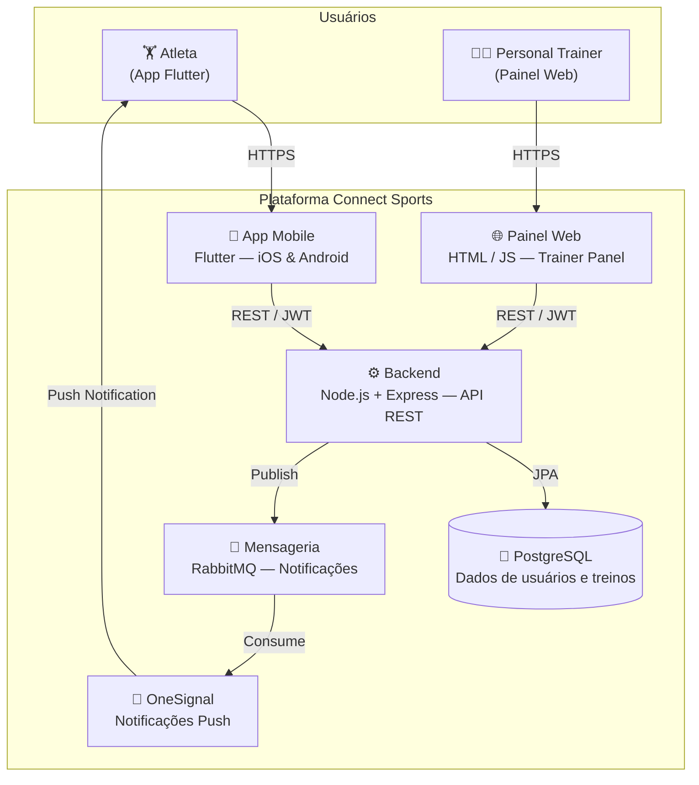

# Connect Sports

Aplicativo mobile de assessoria esportiva que conecta atletas e personal trainers — gestão de treinos, notificações em tempo real e painel web para treinadores.

## O Problema

A assessoria esportiva pessoal ainda depende muito de cadernos, grupos de WhatsApp e planilhas. Personal trainers precisam gerenciar seus alunos de forma manual: enviam treinos por mensagem, controlam pagamentos em papel e não têm visibilidade sobre o progresso dos atletas. Sem um sistema centralizado, a escalabilidade do negócio é limitada e a experiência do atleta é fragmentada.

O Connect Sports nasce para resolver essa equação — uma plataforma completa onde o personal trainer gerencia toda a sua carteira de alunos via painel web e o atleta acompanha seus treinos direto no smartphone.

## Arquitetura

A plataforma é construída sobre uma arquitetura de microsserviços containerizada, onde o app mobile, a API REST e o painel web operam de forma integrada com suporte a notificações assíncronas via mensageria.



## Tecnologias

- **Mobile:** Flutter / Dart
- **Backend:** Node.js, Express, JWT
- **Banco de Dados:** PostgreSQL
- **Mensageria:** RabbitMQ
- **Notificações:** OneSignal
- **Containerização:** Docker & Docker Compose

## Integrantes

| Nome | GitHub |
|------|--------|
| Arthur Araújo Mendonça | [@arthur-amx](https://github.com/arthur-amx) |
| Gabriel Henrique Mota Rodrigues | — |
| Gabrielle Lira Dantas Wanderley | — |
| Matheus Vinicius Mota Rodrigues | — |
| Nathan Gonçalves de Oliveira | — |
| Pedro Luis Gonçalves | — |

**Orientadores:** Cleiton Silva Tavares · Cristiano de Macêdo Neto · Hugo Bastos de Paula

## Estrutura do Projeto

```
.
├── code/
│   ├── api/                    # Backend Node.js
│   │   ├── routes/             # Endpoints da API REST
│   │   ├── middleware/         # Auth JWT, validações
│   │   ├── cronJobs/           # Jobs agendados
│   │   ├── tests/              # Testes com Jest
│   │   └── init-db/            # Scripts de seed do banco
│   ├── connect_sports/         # App Mobile Flutter
│   │   └── lib/
│   │       ├── screens/        # Telas (home, treinos, perfil...)
│   │       ├── services/       # Integração com a API
│   │       └── provider/       # Gerenciamento de estado
│   ├── trainer-panel-web/      # Painel Web do Treinador
│   └── docker-compose.yml
├── docs/                       # Documentação técnica e wireframes
└── assets/                     # Recursos visuais do projeto
```

## Como Executar Localmente

### Pré-requisitos

- [Docker Desktop](https://www.docker.com/products/docker-desktop)
- [Flutter SDK](https://flutter.dev/docs/get-started/install) 3.7.0+
- [Node.js](https://nodejs.org/) 16+

### 1. Clone o repositório

```bash
git clone https://github.com/arthur-amx/connect-sports.git
cd connect-sports
```

### 2. Suba os serviços com Docker

```bash
cd code
docker-compose up -d
```

Este comando iniciará:

- **API Node.js** na porta `3000`
- **PostgreSQL** na porta `5433`
- **RabbitMQ** para mensageria
- **Painel Web do Treinador** na porta `8080`

### 3. Configure e rode o App Flutter

```bash
cd code/connect_sports
flutter pub get
flutter run
```

> Para rodar em dispositivo físico, ative o **Modo Desenvolvedor** e a **Depuração USB** nas configurações do Android.

## Acessando os Serviços

### Backend e Painel Web

| Serviço | Endereço |
|---------|----------|
| API REST | `http://localhost:3000` |
| Painel Web do Treinador | `http://localhost:8080` |
| PostgreSQL | `localhost:5433` |
| RabbitMQ Management | `http://localhost:15672` |

### App Mobile

Execute em um emulador Android via Android Studio ou em um dispositivo físico com `flutter run`.

## Funcionalidades

- Cadastro e autenticação de atletas e personal trainers (JWT)
- Criação e gerenciamento de planos de treinamento personalizados
- Acompanhamento de progresso e histórico do atleta
- Painel administrativo web para treinadores
- Notificações push em tempo real (OneSignal + RabbitMQ)
- Sistema de eventos e feedback entre atleta e trainer

## Documentação

- [Documento de Arquitetura](docs/architecture_document.md)
- [Wireframes](docs/Wireframes/)
- [Plano de Testes](docs/Plano%20de%20Testes%20-%20Connect%20Sports%20-%20atualizado.pdf)
- [Relatório de Encerramento](docs/RelatorioEncerramento.pdf)

## Histórico de Versões

### 1.0.0 — 2025-06-25 (Versão Final)
- Sistema completo de autenticação JWT
- CRUD de usuários com perfis diferenciados (atleta / trainer)
- Gestão de planos de treinamento
- Painel web para personal trainers
- Integração com OneSignal para notificações push
- Mensageria assíncrona com RabbitMQ
- Testes unitários (Jest + Flutter Test)
- Containerização completa com Docker Compose

### 0.3.0 — 2025-05-26
- Interface do painel web para trainers
- Sistema de relatórios e dashboards
- Funcionalidade de comunicação entre usuários

### 0.2.0 — 2025-04-30
- Sistema de login e cadastro
- Estrutura base da API REST
- Configuração do PostgreSQL e middleware de autenticação

### 0.1.0 — 2025-03-25
- Estrutura base do Flutter
- Setup do Docker
- Wireframes principais e definição de arquitetura

### 0.0.1 — 2025-03-07
- Kickoff do projeto
- Modelagem do processo de negócios e requisitos
- Lean Inception e visão do produto

---

> Projeto acadêmico desenvolvido na PUC Minas — Engenharia de Software · 2025/1
