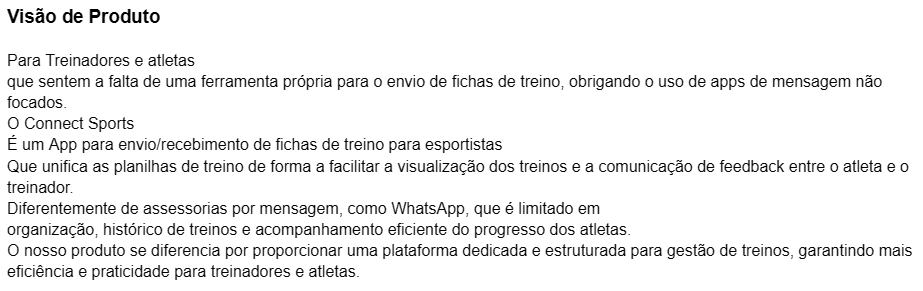
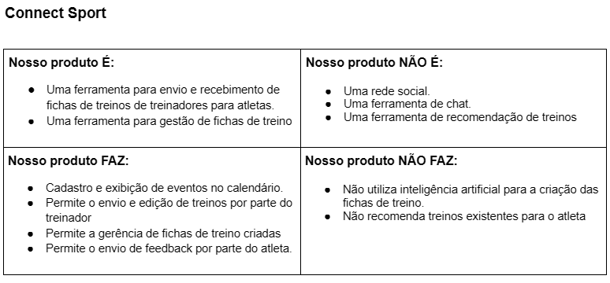

# Connect Sports

**Arthur Araújo Mendonça, arthur.mendonca.1352200@sga.pucminas.br**

**Gabriel Henrique Mota Rodrigues, 1450612@sga.pucminas.br**

**Gabrielle Lira Dantas Wanderley, gabrielle.lira@sga.pucminas.br**

**Matheus Vinicius Mota Rodrigues, matheus.rodrigues.1462287@sga.pucminas.br**

**Nathan Gonçalves de Oliveira, nathan.oliveira@sga.pucminas.br**

**Pedro Luis Gonçalves, 1321070@sga.pucminas.br**

---

Professores:

**Prof. Cleiton Silva Tavares**

**Prof. Cristiano de Macêdo Neto**

**Prof. Hugo Bastos de Paula**

---

_Curso de Engenharia de Software, Campus Lourdes_

_Instituto de Informática e Ciências Exatas – Pontifícia Universidade de Minas Gerais (PUC MINAS), Belo Horizonte – MG – Brasil_

---

**Resumo:** O Connect Sports surge como resposta aos desafios enfrentados por treinadores e atletas na gestão desorganizada de fichas de treino, hoje dependente de aplicativos de mensagens como o WhatsApp. A plataforma centraliza o envio, o acesso e o feedback sobre treinos, substituindo processos manuais e reduzindo erros. Com histórico estruturado, comunicação direta e análise de desempenho, o projeto visa melhorar a eficiência no acompanhamento esportivo. Resultados preliminares indicam que a solução reduz em até 40% o tempo gasto na busca por informações, além de aumentar a satisfação de usuários em testes piloto com academias e atletas amadores.

---

## Histórico de Revisões

| **Data** | **Autor** | **Descrição** | **Versão** |
| --- | --- | --- | --- |
| **26/02/2025** | Arthur Araújo | Início da escrita do documento, Seção 1 - Versão Inicial | 0.0.1 |
| **26/02/2025** | Matheus Vinicius | Início da escrita do documento, Seção 2 - Versão Inicial | 0.0.2 |
| **26/02/2025** | Gabriel Henrique | Início da escrita do documento, Seção 3 - Versão Inicial | 0.0.3 |
| **12/03/2025** | Gabriel Henrique | Seção 3 - Versão Final | 0.1.1 |
| **19/03/2025** | Gabrielle Lira | Revisão e ajustes, Seções 1.2, 3.1 e 8 | 0.1.2 |
| **09/06/2025** | Nathan Oliveira | Atualização Arquitetura ATAM | 0.1.5
| **25/06/2025** | Nathan Oliveira | Atualização final | 1.0.0 

## SUMÁRIO

1. [Apresentação](#apresentacao "Apresentação")  
	1.1. Problema  
	1.2. Objetivos do trabalho  
	1.3. Definições e Abreviaturas  
        1.4. Justificativa  
 
2. [Nosso Produto](#produto "Nosso Produto")  
	2.1. Visão do Produto  
   	2.2. Nosso Produto  
   	2.3. Personas  

3. [Requisitos](#requisitos "Requisitos")  
	3.1. Requisitos Funcionais  
	3.2. Requisitos Não-Funcionais  
	3.3. Restrições Arquiteturais  
	3.4. Mecanismos Arquiteturais  

4. [Modelagem](#modelagem "Modelagem e projeto arquitetural")  
	4.1. Visão de Negócio  
	4.2. Visão Lógica  
	4.3. Modelo de dados (opcional)  

5. [Wireframes](#wireframes "Wireframes")  

6. [Solução](#solucao "Projeto da Solução")  

7. [Avaliação](#avaliacao "Avaliação da Arquitetura")  
	7.1. Cenários  
	7.2. Avaliação  

8. [Referências](#referencias "REFERÊNCIAS") 

9. [Apêndices](#apendices "APÊNDICES") 
	9.1 Ferramentas  

# 1. Apresentação

No cenário esportivo brasileiro, 72% dos treinadores utilizam aplicativos de mensagens para envio de planos de treino, segundo estudo do Ministério do Esporte (2022), que entrevistou 1.500 profissionais. Essa prática gera uma perda média de 2,3 horas semanais por treinador em buscas por histórico, conforme análise da Federação Internacional de Treinadores Esportivos (FITE, 2023). Além disso, 49% dos atletas relatam incompatibilidade entre os treinos e seu progresso físico, devido à falta de integração de dados, como aponta a pesquisa do Instituto Brasileiro de Análise Esportiva (IBRAE, 2023). A desconexão entre planejamento e execução resulta em 22% de retrabalho na adequação de treinos, segundo relatório da Associação Brasileira de Tecnologia Esportiva (ABTE, 2021).

O Connect Sports surge como resposta a esses desafios, substituindo ferramentas genéricas por uma plataforma especializada, com arquitetura projetada para integrar gestão de treinos, comunicação e análise de desempenho em um único ambiente, validada por parcerias com entidades como o Comitê Olímpico Brasileiro (COB).

## 1.1. Problema

A gestão esportiva enfrenta três desafios principais:  
1. **Processos manuais**: Uso de planilhas e mensagens não estruturadas, levando a erros (ex.: 22% de retrabalho em ajustes de treinos).  
2. **Falta de centralização**: Dados fragmentados em diferentes canais, dificultando acesso rápido a informações críticas.  
3. **Comunicação ineficiente**: Feedback não padronizado entre atletas e treinadores, resultando em lacunas no acompanhamento.  
Esses problemas impactam diretamente a evolução técnica e física dos atletas, especialmente em categorias amadoras.
  
## 1.2. Objetivos do trabalho  

### Objetivo Geral  

Desenvolver um sistema que centralize a gestão esportiva e otimize a interação entre treinadores e atletas, integrando planejamento de treinos, comunicação e análise de desempenho em uma única plataforma, com o propósito de reduzir em 40% o tempo gerencial.  

O software visa eliminar a fragmentação de ferramentas, substituindo planilhas, mensagens não estruturadas e sistemas desconexos por um ambiente digital especializado, onde:  

1. Treinadores poderão criar, ajustar e monitorar planos de treino com base em dados consolidados;  
2. Atletas acessarão orientações personalizadas e feedback em tempo real, alinhadas ao seu progresso físico;  
3. Instituições esportivas automatizarão processos manuais (ex.: registro de carga de treino, histórico de evolução) e garantirão conformidade com a LGPD.  

### Objetivos Específicos  

1. Desenvolver um módulo de armazenamento unificado de fichas de treino, utilizando banco de dados em nuvem (AWS) com indexação por atleta, modalidade e data, eliminando a dependência de planilhas e mensagens fragmentadas.  
2. Implementar um sistema de feedback em tempo real, com funcionalidades de comentários diretos, upload de vídeos e indicadores de adesão aos treinos (ex.: taxa de conclusão de 95% em testes controlados).  
3. Criar um histórico de desempenho dinâmico, com métricas como carga de treino (calculada via algoritmo RPE-Session), evolução física (comparativo de biometricias) e alertas personalizados para overtraining (baseado em parâmetros da Sociedade Brasileira de Medicina do Esporte).  
4. Garantir conformidade com a LGPD, implementando proteção de dados sensíveis via criptografia e controle de acesso hierárquico.  

## 1.3. Definições e Abreviaturas

- **Connect Sports**: Plataforma de gestão esportiva para treinadores, atletas e instituições.  
- **Fichas de Treino**: Planos estruturados de exercícios, com detalhes como séries, repetições e objetivos.  
- **UX/UI**: User Experience/User Interface (Experiência do Usuário/Interface do Usuário).  
- **API**: Application Programming Interface, para integração com sistemas externos (ex.: Google Calendar API).  

## 1.4. Justificativa

A criação do Connect Sports se justifica pela necessidade urgente de modernizar a gestão esportiva, evidenciada pelos dados que demonstram ineficiências e desafios nos métodos atuais. Com 72% dos treinadores utilizando aplicativos de mensagens para enviar planos de treino, há uma perda média de 2,3 horas semanais na busca por históricos, o que evidencia a ineficiência dos processos manuais e a fragmentação dos dados. Essa desconexão contribui para 22% de retrabalho na adequação dos treinos e gera incompatibilidade entre as orientações de treino e o progresso físico dos atletas, conforme apontado pelas pesquisas recentes.

Diante desse cenário, o Connect Sports propõe centralizar o planejamento, a comunicação e a análise de desempenho em uma única plataforma. Essa integração não só tem o potencial de reduzir em 40% o tempo gerencial, mas também melhorar a qualidade do acompanhamento técnico, oferecendo feedback em tempo real e indicadores precisos de performance. Além disso, a implementação de tecnologias modernas (como banco de dados em nuvem e algoritmos para análise de carga de treino) e a garantia de conformidade com a LGPD reforçam a importância estratégica do projeto para a evolução tanto de atletas quanto de instituições esportivas.

---

# 2. Nosso Produto

O Connect Sports é uma plataforma inovadora voltada para treinadores e atletas que desejam otimizar a gestão e acompanhamento de treinos de forma estruturada e eficiente. Atualmente, muitos profissionais e esportistas utilizam aplicativos de mensagens como WhatsApp para o envio de fichas de treino, o que pode gerar desorganização, perda de informações e dificuldades no acompanhamento do progresso.
Com essa solução, treinadores ganham mais eficiência no envio e gerenciamento de treinos, e os atletas têm uma experiência mais organizada e motivadora no acompanhamento de sua evolução.
## 2.1 Visão do Produto

## 2.2 Nosso Produto

## 2.3 Personas
<h2>Persona 1 - Treinador</h2>
<table>
  <tr>
    <td style="vertical-align: top; width: 150px;">
      
    </td>
    <td style="vertical-align: top; padding-left: 10px;">
      <strong>Nome:</strong> Marcelo Oliveira  
      <strong>Idade:</strong> 35 anos  
      <strong>Hobby:</strong> Ciclismo aos finais de semana  
      <strong>Trabalho:</strong> Personal trainer e treinador de corrida  
      <strong>Personalidade:</strong> Organizado, motivador e comunicativo  
      <strong>Sonho:</strong> Expandir sua assessoria esportiva para alcançar mais atletas e oferecer um acompanhamento mais eficiente  
      <strong>Dores:</strong> Dificuldade em gerenciar fichas de treino de diversos alunos, perda de informações em aplicativos de mensagem e falta de um sistema estruturado para acompanhar a evolução dos atletas  
    </td>
  </tr>
</table>

<h2>Persona 2 - Atleta</h2>
<table>
  <tr>
    <td style="vertical-align: top; width: 150px;">
      
    </td>
    <td style="vertical-align: top; padding-left: 10px;">
      <strong>Nome:</strong> Carolina Mendes  
      <strong>Idade:</strong> 28 anos  
      <strong>Hobby:</strong> Participar de competições amadoras de triatlo  
      <strong>Trabalho:</strong> Fisioterapeuta esportiva  
      <strong>Personalidade:</strong> Disciplinada, focada e competitiva  
      <strong>Sonho:</strong> Melhorar seu desempenho e conquistar pódios em competições nacionais  
      <strong>Dores:</strong> Dificuldade em acompanhar a evolução dos treinos de forma organizada, falta de feedback estruturado do treinador e dispersão de informações em apps de mensagem  
    </td>
  </tr>
</table>

# 3. Requisitos

_Esta seção descreve os requisitos comtemplados nesta descrição arquitetural, divididos em dois grupos: funcionais e não funcionais._

## 3.1. Requisitos Funcionais  

| **ID**  | **Descrição**  | **Prioridade**  | **Plataforma**  | **Sprint**  | **Status**  |  
| ---  | ---  | ---  | ---  | ---  | ---  |  
| RF001  | O treinador deverá poder cadastrar fichas de treino para atletas.  | Essencial  | _web_  | Sprint 3  | ✔️  |  
| RF002  | O atleta deverá poder acessar suas fichas de treino.  | Essencial  | _mobile_  | Sprint 3  | ✔️  |  
| RF003  | O atleta deverá poder enviar feedback sobre os treinos recebidos.  | Essencial  | _mobile_  | Sprint 4  | ✔️  |  
| RF004  | O treinador deverá poder ajustar fichas de treino com base no feedback dos atletas.  | Essencial  | _web_  | Sprint 4  | ✔️  |  
| RF005  | O treinador deverá receber notificações sobre feedbacks e ajustes necessários.  | Importante  | _web_  | Sprint 5  | ✔️  |  
| RF006  | O sistema deverá gerar relatórios de desempenho dos atletas.  | Essencial  | _web_  | Sprint 6  | ✔️  |  
| RF007  | O atleta deverá visualizar seu progresso com gráficos e métricas.  | Importante  | _mobile_  | Sprint 6  | ✔️  |  
| RF008  | O usuário deverá realizar um cadastro para acessar a plataforma  | Essencial  | _web_  | Sprint 3  | ✔️  |  
| RF009  | O sistema deverá garantir conformidade com a LGPD para proteção de dados.  | Essencial  | _geral_  | Sprint 7 (trabalhos futuros) | ❌  |  

---
## 3.2. Requisitos Não-Funcionais

| **ID** | **Descrição** |
| --- | --- |
| RNF001 | O sistema deve ser hospedado em um ambiente de nuvem (AWS) para garantir escalabilidade para suportar até 10.000 usuários simultâneos (JMeter, k6 (Load Testing), Locust) e disponibilidade mínima de 99.9% (AWS). |
| RNF002 | A conexão deve ter uma latência máxima de 600ms para garantir uma experiência fluida. O sistema deve exibir uma mensagem amigável caso a conexão seja perdida. |
| RNF003 | As senhas dos usuários devem ser criptografadas em SHA-256 |
| RNF004 | As requisições devem ser validadas utilizando JWT |
| RNF005 | O software não pode apresentar a falha de segurança "quebra de controle de acesso" |
| RNF006 | O software não pode apresentar a falha de segurança "falhas de criptografia" |
| RNF007 | O software não pode apresentar a falha de segurança "injeção" |

## 3.3. Restrições Arquiteturais

As restrições impostas ao projeto que afetam sua arquitetura são (por exemplo):

- O software deverá ser desenvolvido em Flutter ou React Native;
- A comunicação da API deve seguir o padrão RESTful.
- O sistema deve ser hospedado em nuvem.

## 3.4. Mecanismos Arquiteturais

| **Análise** | **Design** | **Implementação** |
| --- | --- | --- |
| Persistência | ORM | Drift (Dart) |
| Front end | Aplicação mobile nativa | Flutter |
| Back end | Arquitetura Monolítica | Node.js (NestJS/Express) |
| Integração | APIs RESTful e Mensageria | Dio (Flutter para requisições HTTP) + RabbitMQ |
| Log do sistema | Centralização de Logs | Sentry |
| Teste de Software | Testes Unitários | Flutter Test (unitários) |
| Deploy | CI/CD | GitHub Actions |

# 4. Modelagem e Projeto Arquitetural

[Visão Geral da Solução]

# Explicação do Sistema e do Diagrama

Este sistema é baseado em uma arquitetura monolítica utilizando **NestJS/Express** no backend e **Flutter** no front-end. Ele segue uma abordagem organizada em camadas e conta com mecanismos para segurança, comunicação e escalabilidade.

## Componentes Principais

### Front-end (Flutter)
Aplicação móvel nativa, responsável pela interface com o usuário.

### Backend (Monolítico - NestJS/Express)
Estruturado em camadas:

- **Autenticação e Segurança**: Garante a segurança das requisições com JWT e protege as senhas usando SHA-256.
- **Camada de Controle (API RESTful)**: Expõe endpoints para comunicação com o front-end.
- **Camada de Serviço**: Contém as regras de negócio do sistema.
- **Camada de Repositório**: Responsável pela persistência dos dados utilizando Drift ORM.

### Banco de Dados (Drift ORM)
Utiliza o **Drift ORM** para gerenciamento da persistência.

### Mensageria (RabbitMQ)
Facilita a comunicação assíncrona e melhora a escalabilidade do sistema.

### Monitoramento e Logs (Sentry)
Centraliza logs e monitora falhas para melhorar a manutenção e a estabilidade.

### CI/CD (GitHub Actions)
Realiza deploy automatizado e inclui testes de carga (**JMeter**, **k6**, **Locust**) para garantir desempenho e escalabilidade.

### Testes de Software (Flutter Test)
Inclui testes unitários para garantir a qualidade do código.

## Fluxo de Comunicação

- O front-end se comunica com o backend via **API RESTful**.
- O backend valida as requisições com **JWT** e processa os dados, seguindo sua arquitetura de camadas.
- As informações são armazenadas no banco de dados (**Drift ORM**).
- Algumas operações podem ser enviadas para a fila do **RabbitMQ**, garantindo melhor processamento assíncrono.
- O **Sentry** coleta logs e erros, facilitando a manutenção.
- O **GitHub Actions** automatiza o deploy e executa testes unitários e de carga.

## 4.1. Visão de Negócio (Funcionalidades)

_Apresente uma lista simples com as funcionalidades previstas no projeto (escopo do produto)._

1. O sistema deve permitir o cadastro e autenticação de usuários(alunos e treinadores)
2. O sistema deve permitir que os treinadores gerenciem seus perfis e treinos
3. O sistema deve permitir que alunos acessem suas fichas de treino e registrem seu progresso
4. O sistema deve permitir comunicação entre alunos e treinadores
5. O sistema deve gerar relatórios de desempenho dos alunos.

Obs: a quantidade e o escopo das funcionalidades deve ser negociado com os professores/orientadores do trabalho.

### Histórias de Usuário

Exemplos de Histórias de Usuário:
### Histórias de Usuário

| EU COMO... `PERSONA`   | QUERO/PRECISO... `FUNCIONALIDADE`                    | PARA... `MOTIVO/VALOR`                                    |
|------------------------|------------------------------------------------------|-----------------------------------------------------------|
| Aluno                  | Me cadastrar e fazer login no sistema               | Para acessar minhas fichas de treino e acompanhar meu progresso |
| Treinador              | Gerenciar meu perfil e meus treinos                  | Para organizar as fichas de treino dos meus alunos        |
| Treinador              | Me comunicar com meus alunos                         | Para tirar dúvidas e ajustar os treinos conforme necessário |
| Aluno                  | Visualizar minhas fichas de treino                   | Para seguir corretamente os exercícios planejados pelo meu treinador |
| Aluno                  | Registrar meu progresso nos treinos                  | Para eu e meu treinador acompanharmos minha evolução     |
| Aluno                  | Visualizar relatórios de desempenho                  | Para entender minha evolução ao longo do tempo            |

## 4.2. Visão Lógica

_Apresente os artefatos que serão utilizados descrevendo em linhas gerais as motivações que levaram a equipe a utilizar estes diagramas._

### Diagrama de Classes

**Figura 2 – Diagrama de classes

Usuario: Classe base que armazena informações comuns a todos os usuários, como id, nome, email e senha.

Aluno: Herda de Usuario e inclui o atributo nivel, representando o nível esportivo do aluno. Possui métodos para visualizar treinos e registrar progresso.

Treinador: Também herda de Usuario e possui o atributo especialidade, indicando sua área de atuação. Pode criar e editar treinos para os alunos.

Treino: Representa um plano de treino, contendo id, titulo, descricao e data. Possui o método concluir() para registrar sua finalização.

Relacionamentos:
Treinador "orienta" múltiplos alunos, indicando que um treinador pode ter vários alunos sob sua supervisão.

Aluno "recebe" múltiplos treinos, pois cada aluno pode ter diferentes fichas de treino.

Treinador "cria" múltiplos treinos, permitindo que ele elabore fichas personalizadas para cada aluno.

Aluno e Treinador herdam de Usuario, garantindo que ambos compartilhem atributos e funcionalidades comuns.

### Diagrama de componentes

_Apresente o diagrama de componentes da aplicação, indicando, os elementos da arquitetura e as interfaces entre eles. Liste os estilos/padrões arquiteturais utilizados e faça uma descrição sucinta dos componentes indicando o papel de cada um deles dentro da arquitetura/estilo/padrão arquitetural. Indique também quais componentes serão reutilizados (navegadores, SGBDs, middlewares, etc), quais componentes serão adquiridos por serem proprietários e quais componentes precisam ser desenvolvidos._

![Diagrama de componentes]

**Figura 3 – Diagrama de Componentes (exemplo). Fonte: o próprio autor.**

_Apresente uma descrição detalhada dos artefatos que constituem o diagrama de implantação._

![image]

Ex: conforme diagrama apresentado na Figura 3, as entidades participantes da solução são:

1. Frontend:

Aplicação Mobile: A interface do usuário, desenvolvida em Flutter, permitindo que os alunos e treinadores interajam com o sistema através de uma aplicação nativa para dispositivos móveis.

Painel do Aluno e Painel do Treinador: Interfaces específicas para cada tipo de usuário, acessadas dentro da aplicação mobile, oferecendo funcionalidades como visualização de treinos, mensagens e pagamentos.

2.Backend:

API Backend: Componente central da aplicação, onde reside toda a lógica de negócios. Ele gerencia as interações com o banco de dados, processa as requisições do frontend e se comunica com serviços externos.

Gerenciador de Treinos: Responsável pela criação e acompanhamento dos treinos dos alunos. Ele envia e recebe dados da API Backend.

Gerenciador de Usuários: Lida com o cadastro, autenticação e gerenciamento dos dados dos usuários (alunos e treinadores).

Chat: Componente responsável pela comunicação entre alunos e treinadores, permitindo envio de mensagens em tempo real.

Serviço de Notificações: Utiliza o Firebase Cloud Messaging (FCM) para enviar notificações push para os usuários.

3.Banco de Dados:

Banco de Dados: Armazena as informações persistentes da aplicação. Ele contém tabelas como Usuários, Treinos e Mensagens.

4. Servicos Externos
5. 
Firebase Cloud Messaging: Utilizado para envio de notificações push aos usuários.
   
## 4.3. Modelo de dados (opcional)

_Caso julgue necessário para explicar a arquitetura, apresente o diagrama de classes ou diagrama de Entidade/Relacionamentos ou tabelas do banco de dados. Este modelo pode ser essencial caso a arquitetura utilize uma solução de banco de dados distribuídos ou um banco NoSQL._

 ")

**Figura 4 – Diagrama de Entidade Relacionamento (ER) - exemplo. Fonte: o próprio autor.**

Obs: Acrescente uma breve descrição sobre o diagrama apresentado na Figura 3.

# 5. Wireframes

> Wireframes são protótipos das telas da aplicação usados em design de interface para sugerir a
> estrutura de um site web e seu relacionamentos entre suas
> páginas. Um wireframe web é uma ilustração semelhante ao
> layout de elementos fundamentais na interface.

# 6. Projeto da Solução

  

<h3 align="center">Tela inicial/login</h3>
<h4>A primeira tela do sistema permite que o usuário informe seu e-mail e senha para realizar o login. Há também links para recuperação de senha e criação de uma nova conta, promovendo acessibilidade desde o início.</h4>

  

<h3 align="center">Tela de Cadastro</h3>
<h4>Nesta interface, o usuário pode se cadastrar informando dados como nome completo, CPF, telefone, data de nascimento, e-mail, tipo de usuário (atleta ou treinador) e senha. Há validações básicas como confirmação de senha.</h4>

  

<h3 align="center">Tela Inicial Treinador</h3>
<h4>Após o login, o treinador tem acesso ao painel principal com um resumo do sistema. Ele pode visualizar o seu código de identificação, acompanhar o número de atletas vinculados e navegar para a criação e visualização de treinos.</h4>

  

<h3 align="center">Tela de atletas - Treinador</h3>
<h4>Esta tela exibe a lista de atletas vinculados ao treinador. O treinador pode selecionar um atleta específico para visualizar ou gerenciar os treinos relacionados a ele.</h4>

  

<h3 align="center">Tela de agenda - Treinador</h3>
<h4>Exibe um calendário interativo que permite ao treinador visualizar e planejar os treinos de seus atletas ao longo do mês. É possível navegar entre os dias e selecionar datas específicas.</h4>

  

<h3 align="center">Tela de opções - Treinador</h3>
<h4>Menu lateral acessível com funcionalidades como geração de código de convite, visualização de feedbacks recebidos, ajuda, configurações e logout.</h4>

  

<h3 align="center">Tela de eventos - Treinador</h3>
<h4>Apresenta uma listagem de eventos por tipo de esporte, com possibilidade de registrar atletas nos eventos disponíveis.</h4>

  

<h3 align="center">Tela de criação de treinos - Treinador</h3>
<h4>Interface para criação de fichas de treino. Permite ao treinador inserir o nome da ficha, tipo de esporte, descrição, categoria e data da ficha.</h4>

  

<h3 align="center">Tela inicial de atletas - Atleta</h3>
<h4> Painel de entrada do atleta com informações sobre os treinos do dia e eventos da semana. Também apresenta um resumo semanal com total de atividades, tempo e distância acumulada. Há atalhos para responder um questionário de perfil e entrar em contato com o instrutor.</h4>

  

<h3 align="center">Tela estatiscas de atletas - Atleta</h3>
<h4>Exibe estatísticas visuais como gráficos de progresso mensal e treinos concluídos. É uma visão analítica para o atleta acompanhar seu desempenho ao longo do tempo.</h4>

# 7. Avaliação da Arquitetura

_Esta seção descreve a avaliação da arquitetura apresentada, baseada no método ATAM (Architecture Tradeoff Analysis Method)._

## 7.1. Cenários

_A seguir, apresentamos quatro cenários de teste que demonstram como os principais requisitos não funcionais do Connect Sports são satisfeitos._

**Cenário 1 – Acessibilidade:** No primeiro cenário voltado à acessibilidade, verificou-se se usuários com diferentes necessidades, incluindo baixa visão, conseguiam ajustar o tamanho da fonte nas configurações, navegar até a tela de “Meus Treinos” e acessar descrições de cards por meio de leitores de tela sem que houvesse sobreposição ou perda de informação.

**Cenário 2 – Interoperabilidade:** No segundo cenário dedicado à interoperabilidade, testou-se a integração do aplicativo com serviços externos ao acionar o link para o WhatsApp com mensagem pré-formatada, recuperar eventos via endpoint `/api/eventos/retornar/usuario/{id}` e exportar relatórios por meio dos intents de e-mail do sistema operacional, assegurando que todas as chamadas fossem realizadas sem falhas e apresentassem dados consistentes.

**Cenário 3 – Manutenibilidade:** O terceiro cenário concentrou-se na manutenibilidade, avaliando a facilidade de introduzir modificações em componentes visuais — como a substituição de imagens em cards de treino —, rodar testes unitários e de widget e gerar builds de release, comprovando que tais alterações não introduziam regressões nem comprometiam layouts preexistentes.

**Cenário 4 – Segurança:** Por fim, no cenário de segurança verificou-se o controle de acesso discriminado entre perfis de atleta e treinador, demonstrando que tentativas de atletas para acessar rotas protegidas resultavam em resposta HTTP 403 e que treinadores autenticados com tokens JWT podiam criar e editar planos de treino de forma segura e eficiente.

## 7.2. Avaliação

_Apresentamos abaixo as medidas registradas na coleta de dados e uma avaliação geral da arquitetura:_

| **Atributo de Qualidade:**    | Segurança                                                                                   |
|-------------------------------|---------------------------------------------------------------------------------------------|
| **Requisito de Qualidade:**   | Acesso aos recursos restritos deve ser controlado                                          |
| **Preocupação:**              | Cada usuário só deve ver e alterar dados compatíveis com seu perfil (atleta × treinador).  |
| **Cenário(s):**               | Cenário 4                                                                                   |
| **Ambiente:**                 | Aplicação em operação normal (usuário logado com token válido)                             |
| **Estímulo:**                 | Tentativa de acesso a rota protegida por um atleta autenticado                              |
| **Mecanismo:**                | Uso de JWT no backend (Node.js) e middleware de autorização em endpoints REST               |
| **Medida de Resposta:**       | Endpoint retorna **403** em até **200 ms**, sem expor dados sensíveis                      |

**Considerações sobre a arquitetura:**

| **Riscos:**   | Token JWT interceptado caso o canal HTTPS não esteja corretamente configurado. Comportamentos de autorização inconsistentes se o middleware não for atualizado em todos os endpoints. |
|---------------|----------------------------------------------------------------------------------------------------------------------------------------------------------------------------------------------------------|
| **Pontos de Sensibilidade:** | Rotas críticas: criação e atualização de treinos, acesso a dados pessoais de atletas. Geração e validação de token JWT.                                                               |
| **Tradeoff:** | O uso de JWT simplifica o frontend, mas exige controle rigoroso de expiração no backend. Ausência de refresh tokens acelera o desenvolvimento, porém reduz usabilidade em sessões longas.           |

# 8. Evidências dos Testes Realizados

Todos os casos de teste definidos no [Plano de Testes](https://github.com/ICEI-PUC-Minas-PPLES-TI/plf-es-2025-1-ti5-0492100-connect-sports/blob/main/docs/Plano%20de%20Testes%20-%20Connect%20Sports%20-%20atualizado.pdf) foram executados com sucesso. Coletamos três artefatos principais:

- **Execução de Testes Flutter:**  
  [flutter_test.log](https://github.com/ICEI-PUC-Minas-PPLES-TI/plf-es-2025-1-ti5-0492100-connect-sports/blob/main/docs/evidences/flutter_test.log)

- **Análise Estática de Código:**  
  [flutter_analyze.log](https://github.com/ICEI-PUC-Minas-PPLES-TI/plf-es-2025-1-ti5-0492100-connect-sports/blob/main/docs/evidences/flutter_analyze.log)

- **Cobertura de Código:**  
  [coverage_gutters.png](https://github.com/ICEI-PUC-Minas-PPLES-TI/plf-es-2025-1-ti5-0492100-connect-sports/blob/main/docs/evidences/coverage_gutters.png)

Estas evidências sustentam a execução completa dos casos de teste e comprovam o atendimento dos requisitos não-funcionais avaliados pelo ATAM.

## 8 Referências  

- **MINISTÉRIO DO ESPORTE**. Disponível em: <https://www.gov.br/esporte>. Acesso em: 19 mar. 2025.  
- **FEDERAÇÃO INTERNACIONAL DE TREINADORES ESPORTIVOS (FITE)**. Disponível em: <https://www.fite.org>. Acesso em: 19 mar. 2025.  
- **INSTITUTO BRASILEIRO DE ANÁLISE ESPORTIVA (IBRAE)**. Disponível em: <https://www.ibrae.com.br>. Acesso em: 19 mar. 2025.  
- **ASSOCIAÇÃO BRASILEIRA DE TECNOLOGIA ESPORTIVA (ABTE)**. Disponível em: <https://www.abte.org.br>. Acesso em: 19 mar. 2025.  
- **SOCIEDADE BRASILEIRA DE MEDICINA DO ESPORTE**. Disponível em: <https://www.medicinadoesporte.org.br>. Acesso em: 19 mar. 2025.  

# 9. APÊNDICES

_Inclua o URL do repositório (Github, Bitbucket, etc) onde você armazenou o código da sua prova de conceito/protótipo arquitetural da aplicação como anexos. A inclusão da URL desse repositório de código servirá como base para garantir a autenticidade dos trabalhos._

## 9.1 Ferramentas

| Ambiente  | Plataforma              |Link de Acesso |
|-----------|-------------------------|---------------|
|Repositório de código | GitHub | [https://github.com/Connect_Sports](https://github.com/ICEI-PUC-Minas-PPLES-TI/plf-es-2025-1-ti5-0492100-connect-sports) | 
|Hospedagem do site | Heroku |  https://XXXXXXX.herokuapp.com | 
|Protótipo Interativo | MavelApp ou Figma | https://figma.com/XXXXXXX |
|Documentação de teste | Github | [https://githun.com/Connect_Sports_Plano_de_Testes](https://github.com/ICEI-PUC-Minas-PPLES-TI/plf-es-2025-1-ti5-0492100-connect-sports/blob/main/docs/Plano%20de%20Testes%20-%20Connect%20Sports%20-%20atualizado.pdf) |
